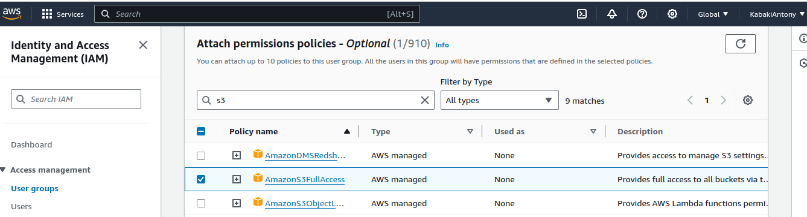
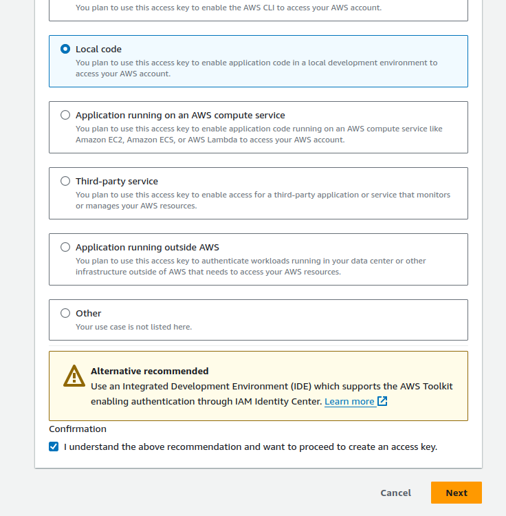

# Managing Static Files in Django

## Introduction To Static Files Management

Django is a high-level Python web development framework, it provides web developers with powerful toolkit to create web applications quickly and efficiently. While it is benefial to create web applications quickly and efficiently, it is equally important to take care of the look and feel of the web applications that you develop, and in order to do that you have learn how to manage the assets that support and provide the look and feel of your applications. In this tutorial, we'll look at what static files are in Django, the benefits of managing them efficiently, their purpose in web applications, and set up a demo project to illustrate how to manage and serve static files using different methods and tools.

### Overview of Static Files in Django

In Django, static files are those files that are served directly to the client without any processing by the server. These typically include CSS, JavaScript files, images, icons, fonts and other assets necessary for the look and feel of your web application. Django provides mechanisms to manage and serve these static files efficiently, ensuring a smooth user experience.

### Importance of Managing Static Files Efficiently

To ensure that the users of your web application have a good user experience and the application performs as expected, then you have to manage the static files efficiently. So if you properly organize and cache your static files it will ensure fast page load times, and responsiveness is improved enhancing overall user satisfaction. Django offers various tools and conventions to aid in the handling of static files.

### Purpose of Static Files in Web Applications

Static files are very important, they set out how a web application looks and feels. They define how components in an application are styled, how they behave in response to user interactions, and eventually what a user sees when they visit a particular web application. When you serve the static files efficiently, you will be able to create a visually appealing and responsive user interface, making the application more engaging and user friendly.

### Setting up a Demo Project

To illustrate the concepts of static files management in Django, we'll set up a demo project from scratch. This project will include creating a Django project, configuring static file settings, and integrating static files into a simple web application. By following along with the demo project, you'll gain hands-on experience with managing static files in Django and understand their significance in web development.

For the purposes of this tutorial, we will create a landing page such that when a user visits the homepage of our project they will see a styled heading welcoming them to the site, it will also display todays date using JavaScript, and we will also serve an image to complete the page.

#### Create a Directory To Hold the Project

Let's begin by creating a directory that will hold the demo project using the following command:

```bash
mkdir sitepoint_django_static_tut
```

#### Create a Virtual Environment

It is recommended to create and isolate new projects within virtual environments, this means that each project will have its' own dependencies without affecting the global Python installation. We will use the `virtualenv` package to create it, if it is not installed in your development environment install it using `pip install virtualenv`, and create a virtual environment using the following command:

```bash
virtualenv myenv
```

The above command creates a virtual environment named `myenv`. To use the virtual environment you have to activate it:

Linux/Mac OS

```bash
. myenv/bin/activate

```

Windows

```bash
. myenv\Scripts\activate
```

#### Install Dependencies

Once the virtual environment is active, you can now go ahead and install the dependencies of your project, for a start we will install Django, we will install other dependencies as we get to the sections that demonstrate their usage.

```bash
pip install Django
```

This will install the latest stable version of Django, and at the making of this tutorial is version 5.0

#### Create a Django Project

Upon successful installation of Django, you now have access to Django management commands, lets use them to create a Django project in the virtual environment:

```bash
django-admin startproject sitepoint_django .
```

The above command will create Django project named `sitepoint_django` and the dot at the end signifies that we intend to create the project in the current directory.

#### Create a Demo App

To illustrate the various concepts of the static file managment we need to create atleast one Django app in our project:

```bash
python manage.py startapp  static_demo
```

This will create a new app in our project named `static_demo`. For it to be recognized by our project we have to add it to the installed apps setting in the `settings.py` file of our project. Open up `sitepoint_django/settings.py` go to the `INSTALLED_APPS` setting and add `static_demo.apps.StaticDemoConfig` to the bottom of the list as shown below.

```python

# sitepoint_django/settings.py

INSTALLED_APPS = [
    # other apps
    'static_demo.apps.StaticDemoConfig',
]
```

#### Create the Homepage Template

As indicated in the introduction of this sub-heading, we will render some html when the user visits the homepage of our site. In the `static_demo` app create a `templates` directory and in it create another directory and name it `static_demo`,  and in this directory create a template and name it `index.html` so the path will be `static_demo/templates/static_demo/index.html`, put in the following code:

```html
<!-- static_demo/index.html -->

<!DOCTYPE html>
<html lang="en">
<head>
    <meta charset="UTF-8">
    <meta name="viewport" content="width=device-width, initial-scale=1.0">
    <title>Sitepoint Django Tutorial</title>
</head>
<body>
    <h2>Hello there, welcome to our great site</h2>
</body>
</html>
```

#### Create the Index View

For the template to be shown to the user whenever they visit the homepage of our app, we need to create a view fuction that will be triggered to render the `home.html` template, therefore, open the `static_demo/views.py` file and put in the following code:

```python
# static_demo/views.py

from django.shortcuts import render


def index(request):
    return render(request, "static_demo/home.html")
```

#### Create  the `static_demo` URL File

We want for the index view in the `static_demo` app to render the homepage whenever a user visits our site, therefore, we will create a url scheme for the view function that will render the homepage. For that we need to create a `urls.py` file for the `static_demo` app. Then connect the `static_demo` URL file to projects URL file.

Therefore, in the `static_demo` app create a file and name it `urls.py`  and add the following code in it.

```python
# static_demo/urls.py

from django.urls import path
from .import views

app_name = 'static_demo'

urlpatterns = [
    path('', views.index, name="index"),
]

```

The above code creates a url for the index view of our project, so if a user visits  something like `http://oursite.com/` or in development when you visit <http://127.0.0.1:8000>  then the index view will be called to respond to that.

Let's add it to the project URL file. Open up the `sitepoint_django/urls.py` file and add the following code in:

```python
# sitepoint_django/urls.py

from django.contrib import admin
from django.urls import path, include # add an import for include

urlpatterns = [
    path('admin/', admin.site.urls),
    path('', include('static_demo.urls')), # add this line
]

```

The above code makes some changes to the default `urls.py` file, we have added an import for `include` fuction, which tells Django that you are including the `static_demo.urls`.

### Running the Project

The initial configuration of the project is done at this point. Let's run the development server to see if everything is tied up well.

Run the project with the following command:

```bash
python manage.py runserver
```

If everything is setup correctly you should be able to visit <http://127.0.0.1:8000>, there you will see some unstyled text welcoming you to the site.

## Serving Static Files in Development

In order to add styling to the page, JavaScript for the date, and the image we have to make changes to the project. Let's make changes to the project incrementally and see how you could serve the different static files in different ways starting with the development evironment.

### Setting up Static Files Directory

Django recommends that all static assests be managed appwise, that is all CSS, js and images that a particular app needs should be resident in the confines of that app. So let's update the `static_demo` app and create a directory named `static` and inside it create another directory named `static_demo`, then in the `static_demo` directory create three more directories that is `css`, `js`, and `images` so in the end you will have a structure similar to the one below:

```output

static_demo/
    └── static/
        └── static_demo/
            ├── css/
            ├── js/
            └── images/

```

The reason why you would want to create a `static_demo` directory in the `static` directory is to help you namespace your static assets in that if you have more than one app and you have the CSS in the apps named as `styles.css` Django would only work with the first stylesheet it finds as it would not be able to distinguish between the others, therefore, you namespace them so that Django will be able to know which asset file you are referring to in your templates.

### Creating the Static Files

In this step let's just setup minimal static assets they will demonstrate how you can serve the files in development, so let's create the three files needed:

In the `js`  directory create a file and name it `todays_date.js`, and put in the following code:

```js

/* static_demo/js/todays_date.js */

let formattedDate = new Date().toLocaleDateString();

document.getElementById('todaysDate').innerText = `The date today is ${formattedDate}`;
```

The above code gets todays date from JavaScript and formats it into a string and then displays it in a div with an id of `todaysDate`.

In the `css` directory create a file and name it `styles.css` and put in the following code:

```css
/* static_demo/css/styles.css */

body {
    display: flex;
    flex-direction: column;
    justify-content: center;
    align-items: center;
    margin: 0;
}

h2 {
    font-size: 24px; 
    color: green;
}
```

The above code uses the flexbox layout to center all the items on the page both horizontally and vertically. It also sets the h2 element font-size to 24 and green color.

For the image you can use any image of your liking just copy some image into the `images` directory and take note of the name.

### Configuring Static Files Settings

To serve static files in development a number of things must be set in the Django `settings.py` file. Therefore open the `sitepoint_django/settings.py` file and check to see it you have the following settings setup.

```python
# sitepoint_django/settings.py`

DEBUG=True
```

In development, it's generally recommended to set `DEBUG` to `True` in your Django project settings. This setting enables various debugging features, including detailed error messages and stack traces, which are invaluable for diagnosing and fixing issues during development. Additionally, when `DEBUG` is set to `True`, the `django.contrib.staticfiles` app automatically serves static files from each app's `static` directory. This behavior simplifies the development process by eliminating the need for manual configuration to serve static files.

Then in the `INSTALLED_APPS` setting, check to see if you have the `django.contrib.staticfiles`  added, if it is not, add it above the apps you have in the project for instance in this project add it above the `static_demo` app string, as shown below:

```python
# sitepoint_django/settings.py`

INSTALLED_APPS = [

    'django.contrib.staticfiles',
    'static_demo.apps.StaticDemoConfig',
]

```

The `django.contrib.staticfiles` app provided by Django is essential for serving static files during development. By default, it traverses your project's apps to locate static files directories within each app. However, if you have additional static assets that are not associated with any particular app, you can still make them accessible to `django.contrib.staticfiles` by setting the `STATICFILES_DIRS` setting in your project's settings.py file. This setting allows you to specify additional directories where static files are located. For example:

```python
# sitepoint_django/settings.py`

STATICFILES_DIRS = [
    "/dir/with/staticfiles/static",
    "/someother/dir/static",
    "/home/example.com/static",
]
```

In addition to `DEBUG` and `STATICFILES_DIRS`, another important setting to include in your Django project settings file is `STATIC_URL`. While Django provides a default value for `STATIC_URL`, you can explicitly define it in your `settings.py` file if it's not already present. The `STATIC_URL` setting specifies the base URL from which static assets will be served. For example, setting `STATIC_URL = "static/"` instructs Django to serve static assets from the `/static/` URL path. This means that, for instance, the styles file located in the `static_demo` app will be accessible at a URL like <http://127.0.0.1:8000/static/static_demo/css/styles.css>.

### Update the Template

With the settings out of the way, to use the static files in the template, we have to update it with the following with the following HTML:

```html
<!-- static_demo/index.html -->

<!-- add static file handling functionality -->


<!DOCTYPE html>
<html lang="en">
<head>
    <meta charset="UTF-8">
    <meta name="viewport" content="width=device-width, initial-scale=1.0">
    <title>Sitepoint Django Tutorial</title>

    <!-- link to css  below -->
    <link rel="stylesheet" href=""> 
</head>
<body>
    <h2>Hello there, welcome to our great site</h2>
    <p id="todaysDate"></p>
    <!-- link to image  below -->
     

    <!-- link to js  below -->
    <script src=""></script>
</body>
</html>

```

That template update introduces us to a new tag ``, this tag loads the static file handling functionality provided by the Django templating engine. Including this tag in a Django template file, enables you to use template tags and filters related to static files. For instance in our template using it enables us to reference static files like images, CSS and js in HTML elements, using it also enables Django to generate URLs for the references static assets:

```html
<link rel="stylesheet" href=""> 

 

<script src=""></script>
```

With those settings and the template update in place, we should run the project and see if the files are being served in development. Run the project using the following command:

```bash
python manage.py runserver
```

If everything is setup correctly you should have the development server running on <http://127.0.0.1:8000> and if you visit that link you should have page similar to the one below:


Haiving a similar image shows that the static files have been applied correctly.

You should note that in Django development, when `DEBUG=True` in your project's settings, and `django.contrib.staticfiles` is enabled, this allows  Django's development server (`runserver`) to serve static files. In this scenario, any changes made to static files, such as CSS, JavaScript, or images, are automatically detected and applied by Django. This seamless process greatly simplifies development, as you will instantly see the effects of your changes without needing to manually refresh or restart the server.

However, in production environments, serving static files typically involves using a separate web server or CDN. In this case, changes to static files may not be automatically detected and applied by Django, necessitating manual intervention to ensure that the updated files are served to users. Additionally, if you opt to manually serve static files using a different method, such as the `django.views.static.serve()` view, automatic detection and application of changes may not occur, and you may need to implement your own mechanisms for handling static file updates

## Serving Static Files Using Whitenoise

In development, while `django.contrib.staticfiles` simplifies the process of serving static assets, ensuring seamless updates as you make changes. However, when transitioning to production, settings like `DEBUG=True` must be disabled, and static files might be served from a CDN or another server. This necessitates a solution that bridges both environments—enabling smooth serving of files during development while accurately reflecting the production environment. Enter the `whitenoise` package. Designed to seamlessly integrate with Django, `whitenoise` offers a robust solution for serving static files in both development and production environments, providing a unified approach that ensures consistency and reliability across deployment stages. Let's explore `whitenoise`.

### Installing and Configuring `whitenoise` in Django

Getting started with `whitenoise` is straightforward.In this section, we'll walk through the installation process and guide you on how to configure `whitenoise` within your Django project.

#### Installation

```bash
pip install whitenoise
```

#### Configuring `staticfiles`

After succesful installation, head over to `sitepoint_django/settings.py` scroll down  bottom and find the `STATIC_URL` setting and below it add the `STATIC_ROOT` setting:

```python

# sitepoint_django/settings.py

STATIC_ROOT = BASEDIR / "staticfiles"

```

The above setting tells Django that when the `collectstatic` is run all static assets in all apps in your project will be collected and stored into this directory named `staticfiles`.

#### Run `collectstatic`

The next thing to do is to run the `collectstatic` management command:

```bash

python manage.py collectstatic
```

#### Enable `whitenoise`

To enable `whitenoise` you have to add it to the `MIDDLEWARE`  settings list, edit the `settings.py` file and add the `whitenoise` middleware after the Django SecurityMiddleware and before all other middleware:

```python

# sitepoint_django/settings.py

MIDDLEWARE = [
    # ...
    "django.middleware.security.SecurityMiddleware",
    "whitenoise.middleware.WhiteNoiseMiddleware",
    # ...
]
```

### Using `whitenoise` in development

While with just the above steps, `whitenoise` can serve you static files in production, if you run the project at this point the Django development server will automatically take over static file handling, but so you can benefit from similar behavior in development and in production it is a good idea to use it serve files in development as well.

To do that we will disable Django's static file handling and allow `whitenoise` to take over by simply editing the settings file and adding the `whitenoise` to `INSTALLED_APPS` list setting above the `django.contrib.staticfiles`:

```python
# sitepoint_django/settings.py

INSTALLED_APPS = [
    # ...
    "whitenoise.runserver_nostatic",
    "django.contrib.staticfiles",
    # ...
]
```

You also need to disable `DEBUG`  by setting it to `False`:

```python
# sitepoint_django/settings.py

DEBUG=False
```

With these steps, you can seamlessly serve your static assets using the `whitenoise` package. To verify that `whitenoise` is indeed serving your files, you can remove or comment out the `django.contrib.staticfiles` option from the `INSTALLED_APPS` setting list. However, it's important to note that removing `django.contrib.staticfiles` will render a few static file management commands unavailable, such as the `collectstatic` command. This command is essential for collecting and consolidating static files from your apps into a single directory for efficient serving in production environments.

### Advanced Configuration Options

While the above steps are sufficient for most cases, `whitenoise` provides a few more options for configuration. For instance you can add compression and caching support to your project. To enable it open the `sitepoint_django/settings.py` file and add the following settings:

```python

# sitepoint_django/settings.py

STORAGES = {
    # ...
    "staticfiles": {
        "BACKEND": "whitenoise.storage.CompressedManifestStaticFilesStorage",
    },
}
```

The above setting will ensure that whitenoise compresses and hashes the static files to unique name, so they will be safely cached.

### Using `whitenoise` in Shared Hosting Environments

Shared hosting is a type of web hosting service where multiple websites are hosted on a single physical server. In this setup, resources such as disk space, bandwidth, and processing power are shared among multiple users, making it a cost-effective option for hosting small to medium-sized websites. Shared hosting environments are typically managed by hosting providers, who handle server maintenance, security, and technical support, allowing website owners to focus on building and managing their websites without needing to worry about server administration tasks.

### Challenges of Managing Static Files in Shared Hosting

While shared hosting offers an affordable and convenient hosting solution for many websites, it also has limitations compared to other types of hosting, such as virtual private servers (VPS) or dedicated servers. These limitations include the following:

- Restrictions to server configurations and settings, limiting the ability to customize server software or install additional tools.

- Resource constraints such as disk space also play a role, as there might be limitations on the amount of bandwidth that can be used to serve these files to visitors.

- Perfomance might be another challenge in shared hosting, because sharing resources with other users can result in slower load times for static files, especially during periods of high traffic or resource utilization.

### Configuring to Use `whitenoise`

`whitenoise` is a Python package that seamlessly integrates with Django, making it an ideal choice for serving static files in shared hosting environments. Unlike other software installations such as `Apache` and `Nginx`, which may not be permissible in certain hosting environments, whitenoise can be easily installed alongside your other project packages.

By configuring Django to use `whitenoise`, you can efficiently serve static files directly from your Django application without the need for additional server software. This simplifies the setup process and ensures compatibility with a wide range of hosting providers.

Most shared hosting providers, provide a cpanel for which allows to do server configurations and file uploads. So once you have uploaded your files you can make the following changes to the project `settings.py` file.

```python
# sitepoint_django/settings.py

STATIC_URL='static/'

# replace username with your cpanel username
# use public_html if you are working on your main domain like https://example.com
STATIC_ROOT='/home/username/public_html/static'

# OR 
# use folder name if you are working on a sub-domain like https://subdomain.example.com
STATIC_ROOT='/home/username/subdomain.mydomain.com/static'
```

With those settings in place all you need to do is run the `collectstatic` command so that your static files will be collected in to any of the above `STATIC_ROOT` directories depending on the domain.

## Serving Static Files From AWS S3

### Introduction to AWS S3

Amazon Simple Storage Service (S3) is a scalable object storage service offered by Amazon Web Services (AWS) it enables users to create storage spaces known as buckets where you can store your various kinds of data like documents, images, videos and notable for our tutorial static files. AWS offers a free tier for several of  its services, including Amazon S3. The free tier allows users to get started with AWS services at no cost for a certain period or up to specific usage limits. To get started you can  [signup for the S3 free tier](https://aws.amazon.com/s3/?p=ft&c=st&z=3), however, to complete the signup process you will need to provide payment information.

### Create S3 Bucket

To create a bucket, go to the S3 dashboard and click on the **Create bucket** button:


Give the bucket a unique dns-compliant, you can optionally select a region closer to you or your users:


Enable ACL for the bucket:


Enable public access for the bucket, by turning off **Block all public access**:


Upon successful creation you should see your bucket on the main S3 page:


### Enable IAM Access

After creation of a bucket you can use the bucket as a root user, but AWS recommends you create an IAM (Identity Access Management) user group and assign them access to only a particular bucket.

#### Create IAM group

Go to the main IAM page and select **User groups** on the sidebar. Then click the **Create group** button. Assign the group a name:


Then under **Attach permisions polices** search for S3 and assign `AmazonS3FullAccess` the click **Create group** button.



#### Create IAM user

While still on the IAM page, select **Users**  on the panel on the left and the click the **Create user** button:


Give the IAM user a name and  click the **Next** button:


Under the **Set permissions**  option leave the **Add user to group** as the selected option,  then go to **User groups** and select the user group you created above and then click the **Next** button:


Review and click **Create user**


Now click on the user name to view the user details. Click on the **Security credentials** tab and then click **Create access key**. Choose **Local code** and click the **Next** button.



After that, click the **Create access key** button, you can copy the keys to your `.env` file if you have one or download the csv file for later usage:


### Configuring Django to Use AWS S3 for Static Files

After creating the S3 bucket, we need to configure the project to serve files from S3, in the previous section we configured `whitenoise` to serve our static assets we need to disable `whitenoise` so that we can serve the assets from S3. To do that go to the `sitepoint_django/settings.py` file and the comment out the following lines of code:

#### Disable `whitenoise`

```python

# sitepoint_django/settings.py

INSTALLED_APPS = [
    # ...
    # "whitenoise.runserver_nostatic",
    # ...
]

MIDDLEWARE = [
    # ...
    # "whitenoise.middleware.WhiteNoiseMiddleware",
    # ...
]


# STORAGES = {
#     "staticfiles": {
#         "BACKEND": "whitenoise.storage.CompressedManifestStaticFilesStorage",
#     },
# }

```

The above code comments out all the settings we had put in place for `whitenoise`

#### Installing packages

For the project to be able to work with S3 we need to install two packages that is `boto3` and `django-storages`. `boto3` provides the low-level Python API for interacting with AWS services, while `django-storages` extends Django's file storage capabilities to integrate with cloud storage providers like Amazon S3, allowing you to seamlessly manage and serve static and media files in your Django application:

```bash
pip install boto3 django-storages
```

#### Configure settings

For our project to be able to serve files from S3 we need to make a few changes to the `settings.py` file and update it with the following code:

```python
# sitepoint_django/settings.py
import os  # first add an import for the os module

# S3 storage setting
STORAGES = {
    'staticfiles': {
        'BACKEND': 'storages.backends.s3boto3.S3Boto3Storage',
        'OPTIONS': {
            'bucket_name': os.getenv('AWS_STORAGE_BUCKET_NAME'),
            'location': 'static',
            'querystring_auth': False,
        },
    }
}
```

The above setting creates a `STORAGES` dictionary that serves as a centralized configuration container for defining various storage backends used within the project. It is important to note this setting is only available for  versions of Django from 4.2 and above, for earlier versions visit the documentation.  In the setting we have a setting for `staticfiles` which identifies the storage configuration for managing staticfiles.

After the `STORAGES`  setting we need to add some AWS specific settings in our settings file so scroll to the portion where you will find the `STATIC_URL` setting and the make the following changes:

```python
# sitepoint_django/settings.py

USE_S3 = os.getenv('USE_S3')

if USE_S3:
    AWS_ACCESS_KEY_ID = os.getenv('AWS_ACCESS_KEY_ID')
    AWS_SECRET_ACCESS_KEY = os.getenv('AWS_SECRET_ACCESS_KEY')
    AWS_S3_OBJECT_PARAMETERS = {
        "CacheControl": "max-age=2592000",
    }

else:
    STATIC_URL = 'static/'
    STATIC_ROOT = BASE_DIR / 'staticfiles'

```

#### Uploading Static Files to S3

Once the settings are in place the next thing is to upload your static files to the S3 bucket, you do that by running `collectstatic`:

```bash
python manage.py collectstatic  --no-input
```

This will collect all static files in our projects apps and put them into the S3 bucket and put them into a `static` folder as defined in the `STORAGES` dictionary. The no `--no-input` flag instructs Django to run in non-interactive mode, bypassing any prompts for user input. When used Django will automatically proceed with that static files collections process without requiring any manual intervention from the user.

#### Running the project

Once all the settings are in place you can run the project, let's run the project in development and serve the files from the S3 bucket:

```bash
python manage.py runserver
```

To verify that indeed that you are serving files from S3 you can view the source page for the  homepage:

```html
<link rel="stylesheet" href="https://sitepoint-django-static.s3.amazonaws.com/static/static_demo/css/styles.css">


<script src="https://sitepoint-django-static.s3.amazonaws.com/static/static_demo/js/todays_date.js"></script>
```

Looking at the HTML elements reveals that indeed the URLs point to the S3 bucket.

## Conclusion

In summary, managing static files in Django involves assessing project requirements, scalability needs, and hosting environment constraints to choose the most suitable method. For instance WhiteNoise middleware provides an efficient solution for serving static files in shared hosting environments, where resource constraints and limited server access may pose challenges. By configuring Django settings appropriately and leveraging tools like WhiteNoise, developers can ensure reliable and optimized static file serving, regardless of the hosting environment. Each method offers its own advantages and considerations, requiring careful evaluation to meet the specific needs of the project and deliver a seamless user experience.

We've covered several key points

Methods for Managing Static Files - We've discussed various approaches, including serving static files locally, using Django's built-in development server, leveraging third-party storage solutions like Amazon S3, serving files using packages like `whitenoise`. Each method has its own advantages and considerations, depending on factors such as scalability, performance, and ease of deployment.

Common Settings and Commands

- `STATIC_ROOT`: Specifies the directory where collected static files will be stored
- `STATIC_URL`: Defines the base URL for accessing static files via the web server.
- `STATICFILES_DIRS`: Specifies additional directories containing static assets.
- `STATICFILES_STORAGE`: Configures the storage backend for handling static files.
- `collectstatic`: Collects all static assets from all app directories to the the `STATIC_ROOT`

Further reading

- [How to manage static files](https://docs.djangoproject.com/en/5.0/howto/static-files/)
- [How to deploy static files](https://docs.djangoproject.com/en/5.0/howto/static-files/deployment/)
